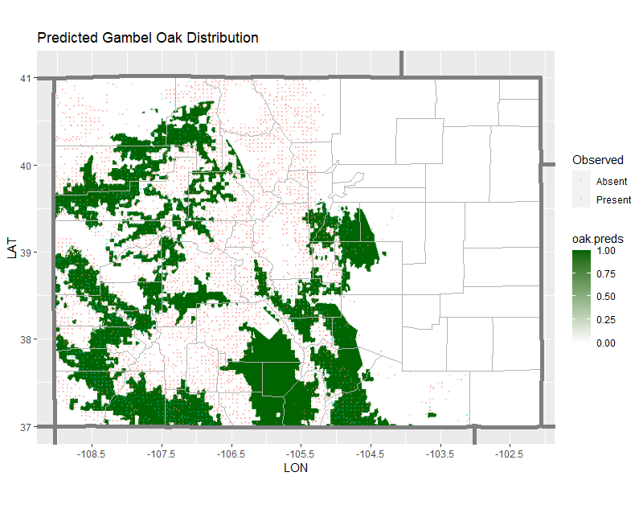

This document provides some supplementary information and plots to accompany the analysis of Colorado Forests. The GAM model marginal effects and residual diagnostics for climate related variables are produces here, along with the additional spatial distribution plots, like the predictions for gambel oak.


```{r setup, include=FALSE}
knitr::opts_chunk$set(echo = FALSE)
```

```{r, echo = F, results=F, warning = F, message=F}
library(rFIA)
library(dplyr)
library(ggplot2)
library(rpart)
library(mgcv)
library(tidyr)
library(RNetCDF)
library(tidync)
library(ncmeta)
library(dplyr)
library(ggplot2)
library(tools)
library(sf)
library(maps)
library(patchwork)

file.maxt <- "C:/Users/jddru/Desktop/ASAENVR/data/era-interim/MAXT.nc" # Maximum temperature
file.mint <- "C:/Users/jddru/Desktop/ASAENVR/data/era-interim/MINT.nc" # Minimum temperature
file.prec <- "C:/Users/jddru/Desktop/ASAENVR/data/era-interim/PREC.nc" # Precipitation


getCDF.data <- function(filePath, lonRange, latRange, timeRange){
  
  ## values for selecting a lat/long range and a time
  
  vals <- t(data.frame(lon = lonRange, 
                    lat = latRange, 
                    tim = timeRange, 
                    row.names = c("min", "max")))
  
  ## Load the file
  
  df.out <- tidync(filePath)
  
  ## Get subset based on lon/lat and time specifications, return what's below
  
  df.out %>% hyper_filter(lon = between(lon, vals["lon", "min"], vals["lon", "max"]), 
                          lat = between(lat, vals["lat", "min"], vals["lat", "max"]), 
                           time = between(time, vals["tim", "min"], vals["tim", "max"])) %>% 
    hyper_tibble()

}

## function to get the times

ParseNetCDFTime <- function(variableMetadata, variableData) {
  
  ## get the time units from metatdata
  time.unit <- nc_atts(variableMetadata, "time") %>% 
    unnest(cols = c(value)) %>% 
    filter(name == "units")
  
  ## get the time parts and return what's below
  time.parts <- utcal.nc(time.unit$value, variableData$time)
  ISOdatetime(time.parts[, "year"],
              time.parts[, "month"],
              time.parts[, "day"],
              time.parts[, "hour"],
              time.parts[, "minute"],
              time.parts[, "second"],
              tz = "UTC")
}

## Grab series
era.ts <- getCDF.data(filePath = file.maxt, 
                       lonRange = c(255,255), 
                       latRange = c(40.5,40.5), 
                       timeRange = c(0,14245))

## Convert the time index to date and drop unnecessary cols
era.ts <- era.ts %>% 
  mutate(date = ParseNetCDFTime(file.maxt, era.ts)) %>% 
  select(-(MAXT)) %>% 
  select(-(lon)) %>% 
  select(-(lat))

## Parse the date to year, month, date for filtering/aggregation
era.ts <- era.ts %>% mutate(year = lubridate::year(date),
                            month = lubridate::month(date),
                            day = lubridate::day(date))

t.start <- as.numeric(era.ts %>% filter(year == 1979, month == 1, day == 1) %>% 
                        select(time))
t.end <- max(era.ts$time)

lat.max <- 45
lat.min <- 33

lon.max <- 262.5
lon.min <- 247.75

maxt.df <- getCDF.data(filePath = file.maxt, 
                       lonRange = c(lon.min,lon.max), 
                       latRange = c(lat.min,lat.max), 
                       timeRange = c(t.start,t.end))
mint.df <- getCDF.data(filePath = file.mint, 
                       lonRange = c(lon.min,lon.max), 
                       latRange = c(lat.min,lat.max), 
                       timeRange = c(t.start,t.end))
prec.df <- getCDF.data(filePath = file.prec, 
                       lonRange = c(lon.min,lon.max), 
                       latRange = c(lat.min,lat.max), 
                       timeRange = c(t.start,t.end))

maxt.df <- inner_join(maxt.df, era.ts, by = "time")
mint.df <- inner_join(mint.df, era.ts, by = "time")
prec.df <- inner_join(prec.df, era.ts, by = "time")

climate.df <- left_join(maxt.df, mint.df) %>% 
  left_join(., prec.df) %>% 
  mutate(date = ParseNetCDFTime(file.maxt, maxt.df)) %>% 
  mutate(year = lubridate::year(date),
         month = lubridate::month(date),
         day = lubridate::day(date)) %>%
  select(lon, lat, MAXT, MINT, PREC, year, month, day)

## Average temperature
temp.avg <- climate.df %>% 
  group_by(lon, lat) %>%
  summarise(AVGT = mean((MAXT + MINT)/ 2 ))

## Average January/February temperature
temp.janAvg <- climate.df %>%
  filter(month %in% c(1,2)) %>%
  group_by(lon, lat) %>%
  summarise(JANT = mean((MAXT + MINT)/2))

## Average July/August temperature  
temp.julyAvg <- climate.df %>%
  filter(month %in% c(7,8)) %>%
  group_by(lon, lat) %>%
  summarise(JULT = mean((MAXT + MINT)/2))

## Variation in mean summer temperature
temp.varS <- climate.df %>%
  filter(month %in% c(6,7,8)) %>%
  group_by(lon,lat) %>%
  summarise(VARS = var((MAXT + MINT)/2))

## Variation in winter mean temperature
temp.varW <- climate.df %>%
  filter(month %in% c(1,2,12)) %>%
  group_by(lon,lat) %>%
  summarise(VARW = var((MAXT + MINT)/2))

## Variation in annual mean temperature
temp.varA <- climate.df %>%
  group_by(lon,lat) %>%
  summarise(VARA = var((MAXT + MINT)/2))

## Difference in summer high and low temperature
temp.diffS <- climate.df %>%
  filter(month %in% c(6,7,8)) %>%
  group_by(lon,lat) %>%
  summarise(DIFS = mean(MAXT - MINT))

## Difference in winter high and low temperature
temp.diffW <- climate.df %>%
  filter(month %in% c(1,2,12)) %>%
  group_by(lon,lat) %>%
  summarise(DIFW = mean(MAXT - MINT))

## Annual cumulative precipitation
temp.precAvg <- climate.df %>%
  group_by(lon,lat) %>%
  summarise(PPT = sum(PREC))

## Summer cumulative precipitation
temp.precS <- climate.df %>%
  filter(month %in% c(6,7,8)) %>%
  group_by(lon,lat) %>%
  summarise(PPTS = sum(PREC))

## Winter cumulative precipitation
temp.precW <- climate.df %>%
  filter(month %in% c(1,2,12)) %>%
  group_by(lon,lat) %>%
  summarise(PPTW = sum(PREC))

## Annual precipitation variation
temp.precvar <- climate.df %>%
  group_by(lon,lat) %>%
  summarise(VARP = var(PREC))

climateSummary.df <- left_join(temp.avg,temp.janAvg) %>%
  left_join(.,temp.julyAvg) %>%
  left_join(., temp.precAvg) %>%
  left_join(., temp.varS) %>%
  left_join(., temp.varW) %>%
  left_join(., temp.varA) %>%
  left_join(., temp.diffS) %>%
  left_join(., temp.diffW) %>%
  left_join(., temp.varW) %>%
  left_join(., temp.precAvg) %>%
  left_join(., temp.precS) %>%
  left_join(., temp.precW) %>%
  left_join(., temp.precvar) 

remove(temp.avg, temp.janAvg, temp.julyAvg, temp.precAvg, temp.highvar, temp.lowvar, temp.precvar)

gam.avgt <- gam(AVGT ~ s(lon) + s(lat) + ti(lon, lat), method = 'REML', data = climateSummary.df)
gam.jant <- gam(JANT ~ s(lon) + s(lat) + ti(lon, lat), method = 'REML',data = climateSummary.df)
gam.jult <- gam(JULT ~ s(lon) + s(lat) + ti(lon, lat), method = 'REML', data = climateSummary.df)
gam.ppt  <- gam(PPT  ~ s(lon) + s(lat) + ti(lon, lat), method = 'REML', data = climateSummary.df)
gam.vars <- gam(VARS ~ s(lon) + s(lat) + ti(lon, lat), method = 'REML', data = climateSummary.df)
gam.varw <- gam(VARW ~ s(lon) + s(lat) + ti(lon, lat), method = 'REML', data = climateSummary.df)
gam.vara <- gam(VARA ~ s(lon) + s(lat) + ti(lon, lat), method = 'REML', data = climateSummary.df)
gam.difs <- gam(DIFS ~ s(lon) + s(lat) + ti(lon, lat), method = 'REML', data = climateSummary.df)
gam.difw <- gam(DIFW ~ s(lon) + s(lat) + ti(lon, lat), method = 'REML', data = climateSummary.df)
gam.ppts <- gam(PPTS ~ s(lon) + s(lat) + ti(lon, lat), method = 'REML', data = climateSummary.df)
gam.pptw <- gam(PPTW ~ s(lon) + s(lat) + ti(lon, lat), method = 'REML',data = climateSummary.df)
gam.varp <- gam(VARP ~ s(lon) + s(lat) + ti(lon, lat), method = 'REML', data = climateSummary.df)
```

# Climate GAM Models

## AVGT Marginal Effects Plots

```{r, fig.height=3.5, fig.width=8, echo = FALSE}
par(mfrow = c(1,3))
plot.gam(gam.avgt, select = 1, residuals = TRUE, xlab = 'Longitude')
plot.gam(gam.avgt, select = 2, residuals = TRUE, xlab = 'Latitude')
plot.gam(gam.avgt, select = 3, residuals = TRUE, xlab = 'Longitude', ylab = 'Latitude')
```

## AVGT Model Residuals

```{r, echo = FALSE}
par(mfrow = c(2,2))
gam.check(gam.difs)
```


## JANT Marginal Effects Plots

```{r, fig.height=3.5, fig.width=8, echo = FALSE}
par(mfrow = c(1,3))
plot.gam(gam.jant, select = 1, residuals = TRUE, xlab = 'Longitude')
plot.gam(gam.jant, select = 2, residuals = TRUE, xlab = 'Latitude')
plot.gam(gam.jant, select = 3, residuals = TRUE, xlab = 'Longitude', ylab = 'Latitude')
```

## JANT Model Residuals

```{r, echo = FALSE}
par(mfrow = c(2,2))
gam.check(gam.difs)
```


## JULT Marginal Effects Plots

```{r, fig.height=3.5, fig.width=8, echo = FALSE}
par(mfrow = c(1,3))
plot.gam(gam.jult, select = 1, residuals = TRUE, xlab = 'Longitude')
plot.gam(gam.jult, select = 2, residuals = TRUE, xlab = 'Latitude')
plot.gam(gam.jult, select = 3, residuals = TRUE, xlab = 'Longitude', ylab = 'Latitude')
```

## JULT Model Residuals

```{r, echo = FALSE}
par(mfrow = c(2,2))
gam.check(gam.difs)
```


## PPT Marginal Effects Plots

```{r, fig.height=3.5, fig.width=8, echo = FALSE}
par(mfrow = c(1,3))
plot.gam(gam.ppt, select = 1, residuals = TRUE, xlab = 'Longitude')
plot.gam(gam.ppt, select = 2, residuals = TRUE, xlab = 'Latitude')
plot.gam(gam.ppt, select = 3, residuals = TRUE, xlab = 'Longitude', ylab = 'Latitude')
```

## PPT Model Residuals

```{r, echo = FALSE}
par(mfrow = c(2,2))
gam.check(gam.difs)
```


## VARS Marginal Effects Plots

```{r, fig.height=3.5, fig.width=8, echo = FALSE}
par(mfrow = c(1,3))
plot.gam(gam.vars, select = 1, residuals = TRUE, xlab = 'Longitude')
plot.gam(gam.vars, select = 2, residuals = TRUE, xlab = 'Latitude')
plot.gam(gam.vars, select = 3, residuals = TRUE, xlab = 'Longitude', ylab = 'Latitude')
```

## VARS Model Residuals

```{r, echo = FALSE}
par(mfrow = c(2,2))
gam.check(gam.difs)
```


## VARW Marginal Effects Plots

```{r, fig.height=3.5, fig.width=8, echo = FALSE}
par(mfrow = c(1,3))
plot.gam(gam.varw, select = 1, residuals = TRUE, xlab = 'Longitude')
plot.gam(gam.varw, select = 2, residuals = TRUE, xlab = 'Latitude')
plot.gam(gam.varw, select = 3, residuals = TRUE, xlab = 'Longitude', ylab = 'Latitude')
```

## VARW Model Residuals

```{r, echo = FALSE}
par(mfrow = c(2,2))
gam.check(gam.difs)
```

## VARA Marginal Effects Plots

```{r, fig.height=3.5, fig.width=8, echo = FALSE}
par(mfrow = c(1,3))
plot.gam(gam.vara, select = 1, residuals = TRUE, xlab = 'Longitude')
plot.gam(gam.vara, select = 2, residuals = TRUE, xlab = 'Latitude')
plot.gam(gam.vara, select = 3, residuals = TRUE, xlab = 'Longitude', ylab = 'Latitude')
```

## VARA Model Residuals

```{r, echo = FALSE}
par(mfrow = c(2,2))
gam.check(gam.difs)
```

## DIFS Marginal Effects Plots

```{r, fig.height=3.5, fig.width=8, echo = FALSE}
par(mfrow = c(1,3))
plot.gam(gam.difs, select = 1, residuals = TRUE, xlab = 'Longitude')
plot.gam(gam.difs, select = 2, residuals = TRUE, xlab = 'Latitude')
plot.gam(gam.difs, select = 3, residuals = TRUE, xlab = 'Longitude', ylab = 'Latitude')
```

## DIFS Model Residuals

```{r, echo = FALSE}
par(mfrow = c(2,2))
gam.check(gam.difs)
```

## DIFW Marginal Effects Plots

```{r, fig.height=3.5, fig.width=8, echo = FALSE}
par(mfrow = c(1,3))
plot.gam(gam.difw, select = 1, residuals = TRUE, xlab = 'Longitude')
plot.gam(gam.difw, select = 2, residuals = TRUE, xlab = 'Latitude')
plot.gam(gam.difw, select = 3, residuals = TRUE, xlab = 'Longitude', ylab = 'Latitude')
```

## DIFW Model Residuals

```{r, echo = FALSE}
par(mfrow = c(2,2))
gam.check(gam.difs)
```

## PPTS Marginal Effects Plots

```{r, fig.height=3.5, fig.width=8, echo = FALSE}
par(mfrow = c(1,3))
plot.gam(gam.ppts, select = 1, residuals = TRUE, xlab = 'Longitude')
plot.gam(gam.ppts, select = 2, residuals = TRUE, xlab = 'Latitude')
plot.gam(gam.ppts, select = 3, residuals = TRUE, xlab = 'Longitude', ylab = 'Latitude')
```

## PPTS Model Residuals

```{r, echo = FALSE}
par(mfrow = c(2,2))
gam.check(gam.difs)
```

## PPTW Marginal Effects Plots

```{r, fig.height=3.5, fig.width=8, echo = FALSE}
par(mfrow = c(1,3))
plot.gam(gam.pptw, select = 1, residuals = TRUE, xlab = 'Longitude')
plot.gam(gam.pptw, select = 2, residuals = TRUE, xlab = 'Latitude')
plot.gam(gam.pptw, select = 3, residuals = TRUE, xlab = 'Longitude', ylab = 'Latitude')
```

## PPTW Model Residuals

```{r, echo = FALSE}
par(mfrow = c(2,2))
gam.check(gam.difs)
```

## VARP Marginal Effects Plots

```{r, fig.height=3.5, fig.width=8, echo = FALSE}
par(mfrow = c(1,3))
plot.gam(gam.varp, select = 1, residuals = TRUE, xlab = 'Longitude')
plot.gam(gam.varp, select = 2, residuals = TRUE, xlab = 'Latitude')
plot.gam(gam.varp, select = 3, residuals = TRUE, xlab = 'Longitude', ylab = 'Latitude')
```

## VARP Model Residuals

```{r, echo = FALSE}
par(mfrow = c(2,2))
gam.check(gam.difs)
```

# Prediced Spatial Distribution of Oak Trees




